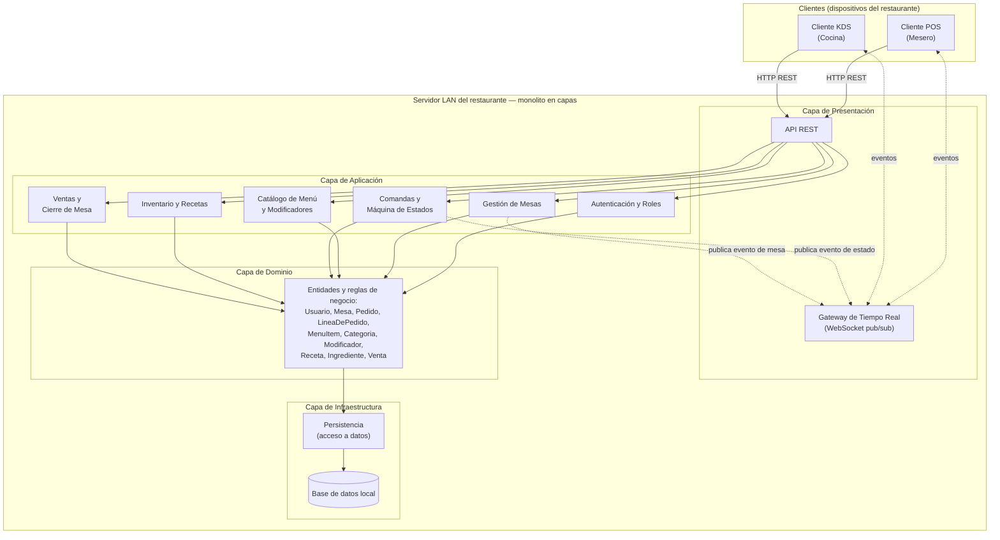

# Diseño Arquitectónico

## Sistema de Pedidos para Restaurante (POS + KDS)

Este documento presenta el diseño arquitectónico del sistema, derivado de los requisitos
extrafuncionales priorizados en `ReqExtrafuncionales.md` y del modelo de dominio descrito en
`DominioEntidades.md`. Sigue la estructura y el nivel de detalle esperado para un entregable de
levantamiento y análisis: estilo, diagrama, descomposición modular y decisiones documentadas como
ADR.

---

## 1. Estilo Arquitectónico

**Estilo adoptado:** monolito en capas (Presentación / Aplicación / Dominio / Infraestructura) con
comunicación orientada a eventos (publish/subscribe vía WebSocket) entre el servidor y los
clientes POS y KDS.

El monolito en capas organiza el código del servidor en las cuatro capas estándar: Presentación
expone la API REST y el Gateway de Tiempo Real; Aplicación orquesta los casos de uso de cada
módulo de negocio; Dominio contiene las entidades y reglas descritas en `DominioEntidades.md`
(incluida la máquina de estados del Pedido); Infraestructura resuelve el acceso a datos. Sobre esa
base, el estilo se complementa con un canal de eventos: cuando la capa de Aplicación confirma un
cambio de estado del Pedido, el Gateway de Tiempo Real publica un evento que todos los clientes
suscritos (POS y KDS) reciben de inmediato, sin que ninguno tenga que refrescar o consultar por su
cuenta.

### Justificación basada en los REF de prioridad Alta

| REF ID | Descripción | Prioridad | Cómo lo aborda el estilo |
|--------|-------------|-----------|---------------------------|
| REF-03 | El envío de una comanda desde el POS y cualquier cambio de estado del pedido se reflejan en todas las pantallas conectadas (POS y KDS) sin recarga manual, con latencia menor a 1 segundo dentro de la LAN. | Alta | La comunicación orientada a eventos es la respuesta directa a este requisito: en cuanto la capa de Aplicación confirma un cambio (por ejemplo, un Pedido que pasa de `PedidoEnEspera` a `EnCocina`), el Gateway de Tiempo Real publica el evento por WebSocket a POS y KDS. Al vivir todo en un único proceso dentro del servidor LAN, no hay saltos de red externos que agreguen latencia. |
| REF-05 | El cocinero debe distinguir el estado de una mesa o de un pedido en el KDS sin depender solo del color, con texto legible a distancia. | Alta | La separación de capas mantiene la lógica de estados del Pedido únicamente en Dominio; el cliente KDS solo se dedica a representar visualmente el estado que recibe por el Gateway de Tiempo Real (color más ícono o forma redundante, tipografía grande). Esto permite iterar la interfaz de legibilidad del KDS sin tocar ninguna regla de negocio. |
| REF-08 | La operación núcleo (toma de pedidos, comandas, KDS) debe funcionar íntegramente sobre la red local del restaurante, sin depender de un enlace a Internet. | Alta | El monolito completo (Presentación, Aplicación, Dominio e Infraestructura, incluido el motor de base de datos) se despliega como un único artefacto en el servidor físico del restaurante, y los clientes POS y KDS se conectan a él solo por la LAN. Ninguna operación núcleo depende de un servicio externo en Internet, por lo que cortar el enlace WAN no interrumpe nada. |
| REF-09 | Si el servidor local se cae o se reinicia durante el servicio, ninguna comanda ya confirmada debe perderse ni duplicarse. | Alta | Al concentrar la escritura de datos en una sola capa de Infraestructura dentro del mismo proceso, cada comanda confirmada se persiste en una transacción atómica antes de publicarse el evento correspondiente. Al reiniciar, el servidor reconstruye su estado desde la última transacción confirmada, sin depender de reconciliar datos entre servicios distribuidos. |
| REF-11 | Toda acción sobre datos del negocio requiere una sesión autenticada, y cada usuario solo accede a las funciones de su rol (Mesero, Cocinero, JefeDeCocina, Administrador). | Alta | La capa de Aplicación aplica un control transversal de autenticación y autorización antes de ejecutar cualquier caso de uso, respaldado por el módulo de Autenticación y Roles como único punto de verdad sobre sesiones y permisos. Al ser un monolito, este control se aplica de forma centralizada y consistente a todos los módulos, sin tener que replicarlo en servicios independientes. |

Ningún REF de prioridad Alta queda sin abordar por el estilo elegido.

### Por qué no microservicios

Microservicios sería sobre-ingeniería para este caso. El equipo que construye el sistema tiene 5
integrantes y un plazo de un semestre con entregas fijas (REF-15); el dominio es acotado, ya que
cubre la operación de un único restaurante y no distintos negocios con necesidades de escalamiento
dispares; y el sistema se despliega como un solo artefacto en el servidor del local, sin
presupuesto para infraestructura paga ni necesidad de escalar módulos de forma independiente.
Microservicios habría agregado complejidad de comunicación entre servicios, orquestación y
despliegue independiente que este proyecto no necesita y que el equipo no tiene el tiempo ni el
tamaño para sostener; el monolito en capas resuelve los mismos requisitos con un costo de
desarrollo y operación mucho menor.

---

## 2. Diagrama de Arquitectura

El diagrama es consistente con el estilo (capas Presentación / Aplicación / Dominio /
Infraestructura, más el canal de eventos del Gateway de Tiempo Real) y con los módulos descritos en
la sección 3.

---

## 3. Descomposición Modular

**Fundamentación:** los módulos se definieron agrupando las entidades y reglas de negocio que
cambian juntas y por las mismas razones (alta cohesión), separándolos de forma que cada uno se
comunique con los demás solo a través de la interfaz que expone su capa de Aplicación, nunca
accediendo directamente a las entidades internas de otro módulo (bajo acoplamiento). El único
canal transversal, consultado por casi todos los módulos, es Autenticación y Roles (para
autorización) y el Gateway de Tiempo Real (para notificar eventos), ambos diseñados como servicios
de infraestructura y no como dueños de lógica de negocio de otro módulo.

### Módulo: Autenticación y Roles

- **Responsabilidad:** gestionar el ciclo de vida de `Usuario`, autenticar mediante PIN por
  empleado y verificar que cada acción solicitada corresponda al rol del usuario (Mesero,
  Cocinero, JefeDeCocina, Administrador). Aborda REF-11.
- **Ofrece a otros módulos:** una interfaz de verificación de sesión y autorización por rol,
  consultada por todos los demás módulos de Aplicación antes de ejecutar cualquier caso de uso.
- **Depende de:** Persistencia.

### Módulo: Gestión de Mesas

- **Responsabilidad:** administrar el ciclo de vida de `Mesa` (alta, estado Libre/Ocupada,
  asignación de mesero) y el traslado de la cuenta y los pedidos activos de una mesa a otra.
- **Ofrece a otros módulos:** consulta del estado y disponibilidad de mesas, y la operación de
  traslado de pedido activo entre mesas, usadas por Comandas y por Ventas.
- **Depende de:** Autenticación y Roles, Persistencia.

### Módulo: Catálogo de Menú y Modificadores

- **Responsabilidad:** mantener `MenuItem`, `Categoria` y `Modificador`: alta y edición de
  platillos, precios, disponibilidad (incluido marcar un ítem como agotado) y modificadores
  asociados.
- **Ofrece a otros módulos:** consulta de ítems disponibles con su precio y modificadores,
  utilizada por Comandas y Máquina de Estados al construir una `LineaDePedido`.
- **Depende de:** Inventario y Recetas (para reflejar disponibilidad cuando falta un ingrediente),
  Autenticación y Roles, Persistencia.

### Módulo: Comandas y Máquina de Estados

- **Responsabilidad:** crear y mantener el `Pedido` y sus `LineaDePedido`; aplicar la validación
  obligatoria de la comanda con el cliente antes de enviarla a cocina (REF-07); y hacer cumplir la
  máquina de estados del Pedido (`PedidoEnEspera` → `EnCocina` → `PedidoServido`, además de
  `Anulado` y `Cerrado`), rechazando cualquier transición no contemplada. El estado intermedio
  "Listo" no existe en este modelo.
- **Ofrece a otros módulos:** eventos de creación y cambio de estado del pedido, publicados a
  través del Gateway de Tiempo Real; y los datos del pedido servido, necesarios para el cierre de
  cuenta en Ventas.
- **Depende de:** Catálogo de Menú y Modificadores, Gestión de Mesas, Autenticación y Roles,
  Gateway de Tiempo Real, Persistencia.

### Módulo: Inventario y Recetas

- **Responsabilidad:** mantener `Receta` e `Ingrediente`, y descontar automáticamente el stock de
  ingredientes cuando una `LineaDePedido` se confirma, según la receta del `MenuItem`
  correspondiente.
- **Ofrece a otros módulos:** nivel de stock y disponibilidad derivada de ingredientes, consumida
  por Catálogo de Menú y Modificadores para marcar ítems agotados.
- **Depende de:** Persistencia.

### Módulo: Ventas y Cierre de Mesa

- **Responsabilidad:** generar la `Venta` al cerrar un `Pedido`, calcular el total, la división de
  la cuenta entre comensales y la propina sugerida (REF-01), y liberar la `Mesa` asociada.
- **Ofrece a otros módulos:** el registro de venta cerrada, disponible para consulta del
  Administrador.
- **Depende de:** Comandas y Máquina de Estados, Gestión de Mesas, Autenticación y Roles,
  Persistencia.

### Módulo: Gateway de Tiempo Real

- **Responsabilidad:** mantener las conexiones WebSocket con los clientes POS y KDS, y publicar y
  distribuir los eventos de dominio (creación de pedido, cambio de estado, cambios de mesa) en
  cuanto ocurren. No posee entidad propia; es infraestructura de comunicación.
- **Ofrece a otros módulos:** un canal de publicación de eventos, usado por Comandas y Máquina de
  Estados y por Gestión de Mesas.
- **Depende de:** ninguno de los módulos de negocio; es invocado por ellos, no al revés.

### Módulo: Persistencia

- **Responsabilidad:** encapsular el acceso a los datos de todas las entidades del dominio,
  garantizando que cada comanda confirmada quede escrita en una transacción atómica antes de
  notificar el evento correspondiente (REF-09). No posee entidad propia; es la capa de acceso a
  datos.
- **Ofrece a otros módulos:** operaciones de guardado y consulta, usadas por todos los módulos de
  Aplicación.
- **Depende de:** ninguno; es la capa más interna, junto con el motor de base de datos local.

### Cliente: POS (Mesero)

- **Responsabilidad:** interfaz para que el Mesero tome comandas, valide la comanda con el cliente
  antes de enviarla a cocina (REF-07), gestione mesas y cierre cuentas.
- **Ofrece a otros módulos:** no aplica; es un cliente consumidor, no un módulo del servidor.
- **Depende de:** la API REST y el Gateway de Tiempo Real del servidor.

### Cliente: KDS (Cocina)

- **Responsabilidad:** interfaz para que Cocinero y JefeDeCocina visualicen las comandas
  pendientes, cambien su estado y sigan los cronómetros de preparación con alta legibilidad
  (REF-05).
- **Ofrece a otros módulos:** no aplica; es un cliente consumidor, no un módulo del servidor.
- **Depende de:** el Gateway de Tiempo Real (recepción de eventos) y la API REST del servidor.

---

## 4. Decisiones de Diseño

### ADR-01 · Monolito en capas vs. microservicios

- **Contexto:** el equipo que construye el sistema tiene 5 integrantes y un plazo fijo de un
  semestre (REF-15), sin presupuesto para infraestructura paga; el dominio se acota a la operación
  de un único restaurante.
- **Decisión:** adoptar un monolito en capas (Presentación / Aplicación / Dominio /
  Infraestructura) como estilo base, desplegado como un único artefacto en el servidor del local.
- **Alternativas consideradas:** microservicios, con un servicio independiente por módulo de
  negocio (Comandas, Inventario, Ventas, etc.).
- **Consecuencias:** se gana simplicidad de despliegue, menor complejidad operativa (sin
  orquestación entre servicios ni red interna adicional) y velocidad de desarrollo acorde al plazo
  y al tamaño del equipo. Se sacrifica la posibilidad de escalar o desplegar módulos de forma
  independiente, algo que este proyecto no necesita porque opera un único restaurante desde un
  único servidor LAN.

### ADR-02 · WebSocket vs. polling para la comunicación POS↔KDS

- **Contexto:** REF-03 exige que los cambios de estado del pedido se reflejen en todas las
  pantallas conectadas sin recarga manual, con latencia menor a 1 segundo dentro de la LAN.
- **Decisión:** usar comunicación orientada a eventos mediante WebSocket (publish/subscribe) desde
  el Gateway de Tiempo Real hacia los clientes POS y KDS.
- **Alternativas consideradas:** polling periódico por HTTP desde los clientes hacia el servidor.
- **Consecuencias:** se gana una actualización casi instantánea y menor tráfico de red comparado
  con consultas repetidas constantes. Se sacrifica algo de simplicidad de implementación, ya que
  hay que manejar conexiones persistentes y su reconexión ante cortes momentáneos de Wi-Fi
  (relevante también para REF-10), en vez de una simple petición GET periódica sin estado de
  conexión.

### ADR-03 · SQLite local vs. base de datos en la nube

- **Contexto:** REF-08 exige que la operación núcleo funcione íntegramente dentro de la LAN, sin
  depender de un enlace a Internet, y REF-15 no contempla presupuesto para servicios de nube
  pagos.
- **Decisión:** usar SQLite como motor de base de datos local, embebido en el servidor del
  restaurante, como único almacenamiento del sistema.
- **Alternativas consideradas:** un motor de base de datos gestionado en la nube.
- **Consecuencias:** se gana independencia total de Internet para la operación núcleo y costo de
  infraestructura nulo. Se sacrifica el acceso remoto centralizado a los datos desde fuera de la
  LAN y la replicación automática que ofrecería un servicio gestionado en la nube, algo que el
  proyecto no requiere porque cada restaurante opera de forma autónoma sobre su propia red local.

### ADR-04 · El servidor LAN del local como fuente de verdad

- **Contexto:** REF-08 y REF-09 exigen que el sistema opere sin Internet dentro de la LAN y que
  ninguna comanda confirmada se pierda ni se duplique si el servidor se cae o se reinicia.
- **Decisión:** el servidor físico del restaurante, conectado a la LAN, es la única fuente de
  verdad del sistema; todos los clientes (POS, KDS) leen y escriben exclusivamente contra él.
- **Alternativas consideradas:** mantener una copia local de los datos en cada tablet cliente, con
  sincronización eventual hacia el servidor.
- **Consecuencias:** se gana consistencia, al no existir conflictos de sincronización entre copias
  de datos, y una recuperación simple ante una caída (el servidor reinicia y reconstruye su estado
  desde la última transacción confirmada). Se sacrifica que un cliente pueda seguir operando de
  forma completamente autónoma si el servidor local se cae, aunque ese escenario ya está cubierto
  por el objetivo de recuperación en 60 segundos de REF-09.

### ADR-05 · No integrar pasarela de pago

- **Contexto:** el sistema cierra cuentas, calcula totales, divide la cuenta entre comensales y
  sugiere propina, pero no procesa pagos con tarjeta ni se integra con pasarelas externas, por lo
  que no aplica PCI-DSS.
- **Decisión:** dejar fuera de alcance cualquier integración con pasarelas de pago; el módulo de
  Ventas y Cierre de Mesa solo registra el método de pago (Efectivo, Tarjeta, Transferencia) y el
  monto correspondiente, sin procesar la transacción de pago en sí.
- **Alternativas consideradas:** integrar una pasarela de pago para procesar tarjetas dentro del
  propio sistema.
- **Consecuencias:** se gana simplicidad, menor superficie de riesgo de seguridad (no se manejan ni
  almacenan datos de tarjetas) y se cumple el plazo del entregable. Se sacrifica la conciliación
  automática de pagos con el sistema, que queda como un registro manual del monto y el método
  elegido por el cajero o mesero.
