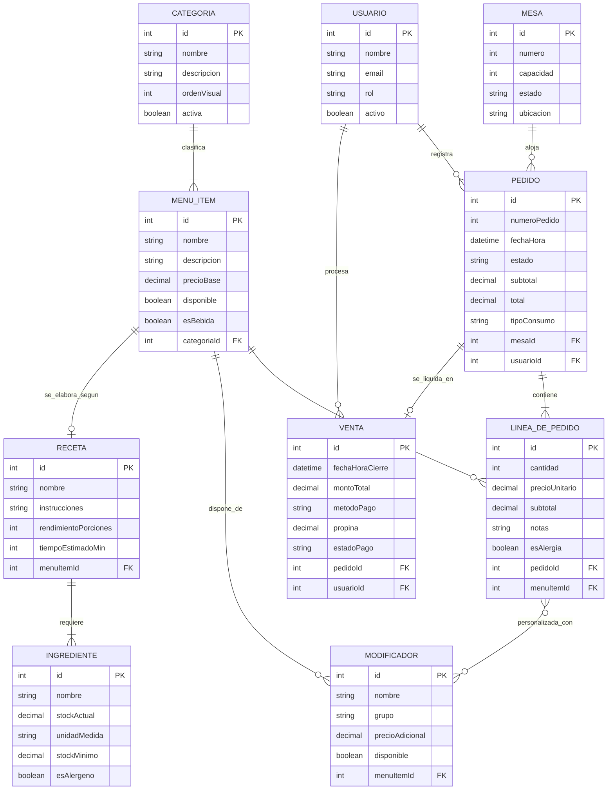
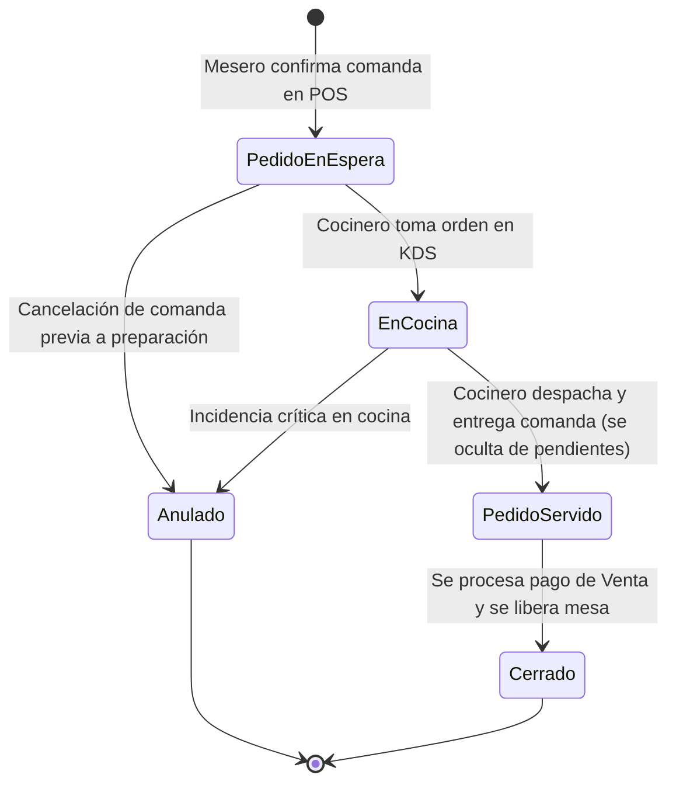

# Modelo de Dominio y Entidades del Sistema

## 1. Nota Metodológica

El presente modelo de dominio fue derivado a partir de las historias de usuario del backlog mediante la heurística lingüística formal descrita en la cátedra: los sustantivos clave del negocio constituyen los candidatos a entidad (ej. *Mesa*, *Pedido*, *MenuItem*), los verbos de acción representan las operaciones y relaciones entre conceptos (ej. *asignar*, *contener*, *servir*), y los adjetivos o estados corresponden a los atributos (ej. *Libre/Ocupada*, *disponible/agotado*). Siguiendo el principio de diseño *"Entidad, no tabla: el dominio primero"*, este modelo captura la semántica y las reglas operativas reales del restaurante (POS + KDS) de forma previa e independiente a cualquier decisión de almacenamiento o esquema físico de base de datos, siendo las futuras tablas una mera consecuencia técnica del concepto del negocio.

---

## 2. Catálogo de Entidades del Dominio

| Entidad | Identidad | Atributos clave | Se relaciona con |
| :--- | :--- | :--- | :--- |
| **Mesa** | `id` | `numero` (int), `capacidad` (int), `estado` (enum: Libre, Ocupada), `ubicacion` (string) | Pedido (1 a N histórico / 1 a 1 activo), Usuario (N a 1, mesero a cargo) |
| **Pedido** | `id` | `numeroPedido` (int), `fechaHora` (datetime), `estado` (enum: Pedido en Espera, En Cocina, Pedido Servido, Anulado, Cerrado), `subtotal` (decimal), `total` (decimal), `tipoConsumo` (enum: Salón, Llevar) | Mesa (N a 1), Usuario (N a 1, mesero que toma el pedido), LineaDePedido (1 a N), Venta (1 a 1) |
| **LineaDePedido** | `id` | `cantidad` (int), `precioUnitario` (decimal), `subtotal` (decimal), `notas` (string), `esAlergia` (boolean) | Pedido (N a 1), MenuItem (N a 1), Modificador (N a N) |
| **MenuItem** | `id` | `nombre` (string), `descripcion` (string), `precioBase` (decimal), `disponible` (boolean), `esBebida` (boolean) | Categoria (N a 1), LineaDePedido (1 a N), Modificador (1 a N), Receta (1 a 1) |
| **Categoria** | `id` | `nombre` (string), `descripcion` (string), `ordenVisual` (int), `activa` (boolean) | MenuItem (1 a N) |
| **Modificador** | `id` | `nombre` (string), `grupo` (string, ej. "Tamaño", "Sabor"), `precioAdicional` (decimal), `disponible` (boolean) | MenuItem (N a 1), LineaDePedido (N a N) |
| **Receta** | `id` | `nombre` (string), `instrucciones` (string), `rendimientoPorciones` (int), `tiempoEstimadoMin` (int) | MenuItem (1 a 1), Ingrediente (1 a N) |
| **Ingrediente** | `id` | `nombre` (string), `stockActual` (decimal), `unidadMedida` (string), `stockMinimo` (decimal), `esAlergeno` (boolean) | Receta (N a N) |
| **Venta** | `id` | `fechaHoraCierre` (datetime), `montoTotal` (decimal), `metodoPago` (enum: Efectivo, Tarjeta, Transferencia), `propina` (decimal), `estadoPago` (enum: Pagado, Anulado) | Pedido (1 a 1), Mesa (N a 1), Usuario (N a 1, cajero/mesero que cobra) |
| **Usuario** | `id` | `nombre` (string), `email` (string), `rol` (enum: Mesero, Cocinero, JefeDeCocina, Administrador), `activo` (boolean) | Pedido (1 a N), Mesa (1 a N), Venta (1 a N) |

---

## 3. Diagrama Entidad-Relación (Mermaid)

El siguiente diagrama refleja directamente las entidades, atributos clave y cardinalidades del negocio descritas en la tabla anterior, renderizable nativamente en GitHub:

---

## 4. Máquina de Estados del Pedido

El ciclo de vida de un `Pedido` es una regla de dominio central para coordinar la toma de comandas (POS) y la preparación en cocina (KDS). Sus transiciones respetan rigurosamente el flujo operativo:

- **Pedido en Espera**: Estado inicial asignado automáticamente cuando el mesero confirma la comanda en el POS; se incorpora a la lista de pedidos pendientes en el KDS.
- **En Cocina**: El personal de cocina toma el pedido y da inicio formal a la preparación de los platillos.
- **Pedido Servido**: La comanda se termina de cocinar y se entrega a la mesa. De acuerdo con la regla de limpieza del KDS (US-10), la orden desaparece inmediatamente de la pantalla de pedidos pendientes en cocina y salón para no sobrecargar visualmente el área de trabajo. *(Regla de dominio: se prescinde explícitamente del estado intermedio "Listo")*.
- **Cerrado**: Estado final de ciclo una vez que los comensales solicitan la cuenta, se genera la `Venta` correspondiente y se libera la mesa.
- **Anulado**: Estado terminal aplicado ante desistimientos del cliente antes de preparar o por incidencias excepcionales justificadas en cocina.

---

## 5. Verificación contra el Backlog

El modelo de entidades planteado soporta de forma nativa dos funcionalidades críticas del backlog sin requerir entidades nuevas:

- **Transferir la cuenta y los pedidos activos de una mesa a otra (US-05)**:
  El Pedido activo simplemente traslada su relación de pertenencia desde la Mesa de origen hacia la Mesa de destino, conservando intactas todas sus Líneas de Pedido acumuladas y su estado de preparación actual. Como regla de consistencia operativa, la mesa de origen pasa a estado Libre al quedar sin cuentas abiertas, mientras que la mesa de destino receptora pasa a estado Ocupada.

- **Marcar un ítem del menú como "Agotado" (US-04)**:
  Se resuelve mediante el atributo de disponibilidad del MenuItem. Cuando un producto se marca como no disponible (ya sea manualmente por cocina o por quiebre en sus ingredientes), el menú digital lo exhibe como agotado e impide que se cree una nueva Línea de Pedido para él, notificando al mesero para evitar tomar la orden, mientras que los consumos registrados con anterioridad preservan su validez histórica.
